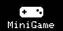

# esp32-firmware-MiniGame
This is a game console firmware and for tft and oled it can takes screenshot and 6 buttons 
it have oled i2c 128x64 and tft spi 128x128
Edit pins you can in ino in 15 to 25 line

#define SCREEN_WIDTH 128
#define SCREEN_HEIGHT 64
Adafruit_SSD1306 display(SCREEN_WIDTH, SCREEN_HEIGHT, &Wire, -1);

#define PIN_UP 18
#define PIN_DOWN 10
#define PIN_LEFT 15
#define PIN_RIGHT 12
#define PIN_SELECT 2
#define PIN_BOOT 0
#define PIN_BACK 40

it you need flash in aruino ide or platformio

 IT HAVE
 Doom
 3d FPS TEST
 Monster hunt
 Bot duel 3d
 Upload bin games
 screenshots
 videos
 an more!
 Tutorial
 To get started, download the ZIP file and extract it; you'll find another ZIP file inside—that’s the one you need! Extract that one as well to locate `minigame.ino`. Open the file in the Arduino IDE or PlatformIO, configure the PSRAM settings based on your specific ESP32 board, and set up the I2C display. Then, go to `pins.h` to configure the button and display pins. Finally, compile and upload the code—good luck with the game!
